# README BinarX Drivers

## Current List of Drivers
1. FGD-02F (Dosimeter) (SPI)
2. ICM42670P (6-AXIS IMU // Gyro + Accelerometer) (I2C)
3. MMC5983MA (3-AXIS Magnetometer) (I2C)

## How to install External Driver Code Into Your STM32CubeIDE Project

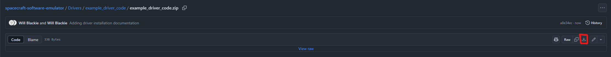

1. Unzip the downloaded Driver code

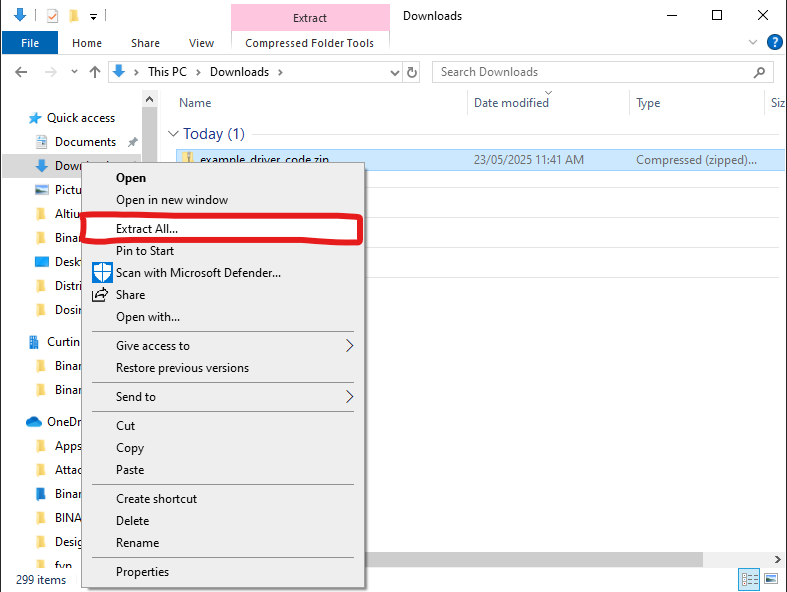

1. Drag the unzipped folded into the project directory

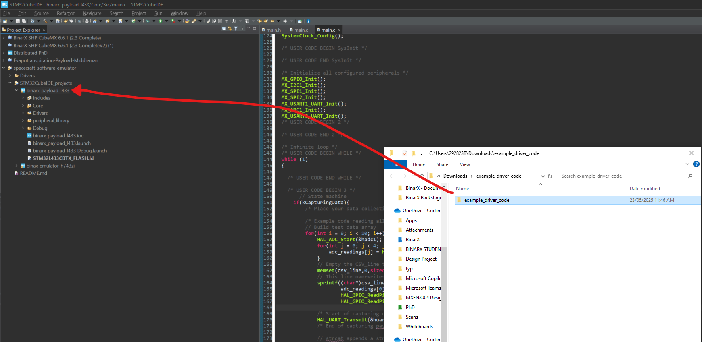

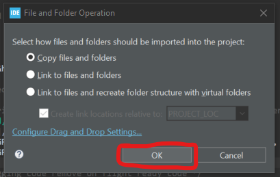

2. Right click on your project file

3. Select properties from the dropdown menu

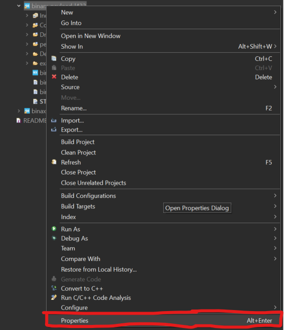

4. Open the dropdown for "C/C++ General" and select "Paths and Symbols"

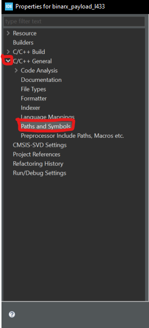

5. Under the "Includes" tab

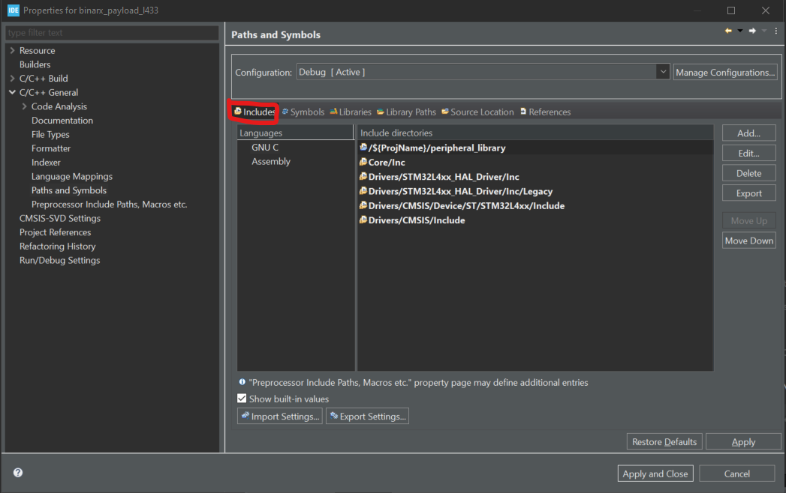

6. select the "Add..." button on the right

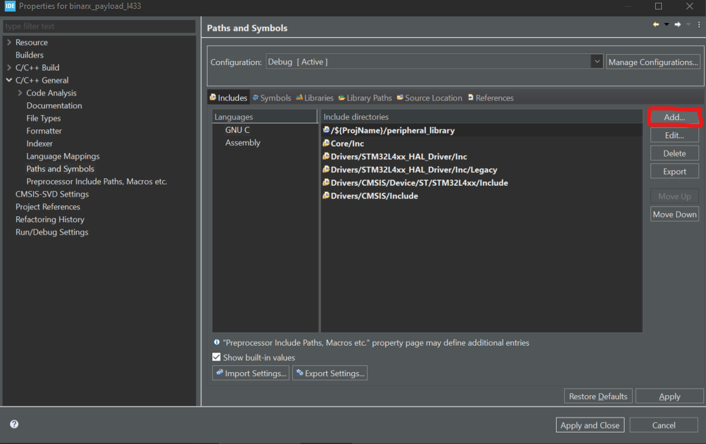

7. From the popup select "Workspace..." then find the added folder "example_driver_code"

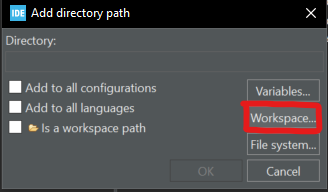

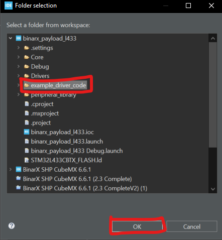

8.  Select the driver folder in the list and move it up to under "peripheral_library"

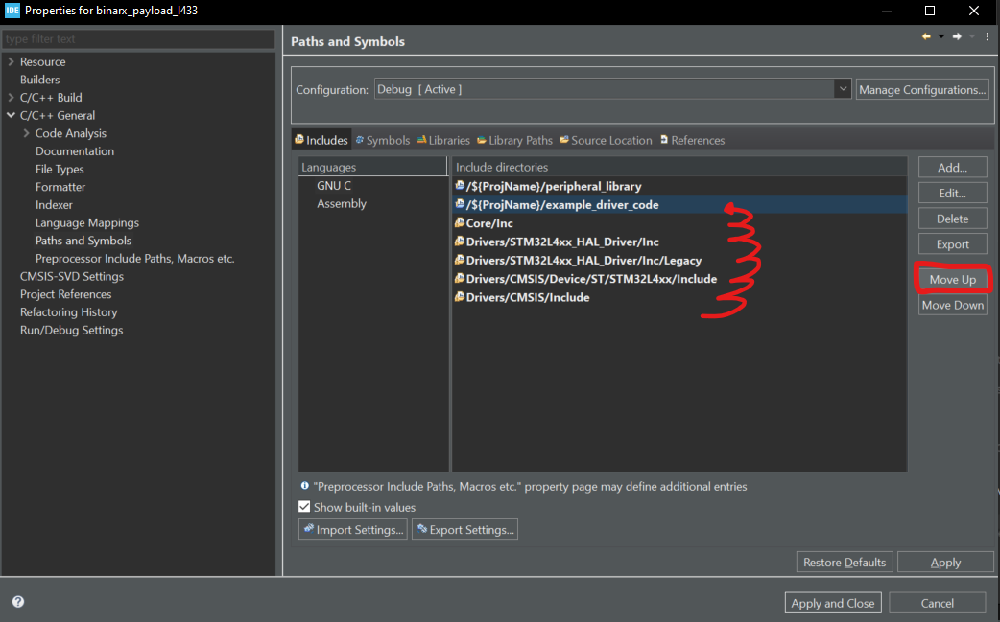

9.  Move to the "Source Location" tab and repeat step 7

10. Select the drive code folder from the workspace and click "OK"

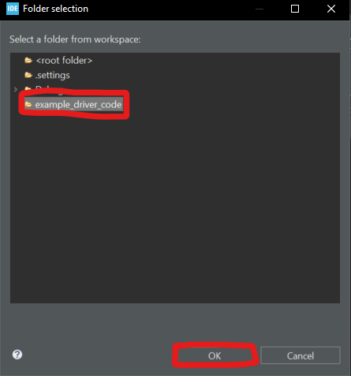

11. Select "Apply and close"

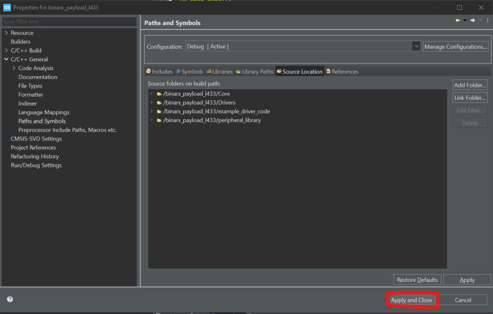

12. Head to your main.c file and add a "#include" statement like the one below
    
    ``` #include "example_drive_code.h" ```

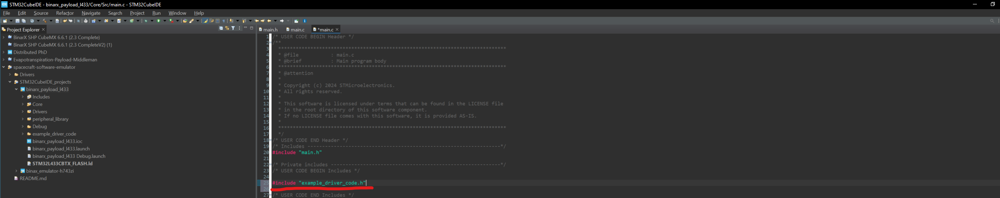

13. Build the project

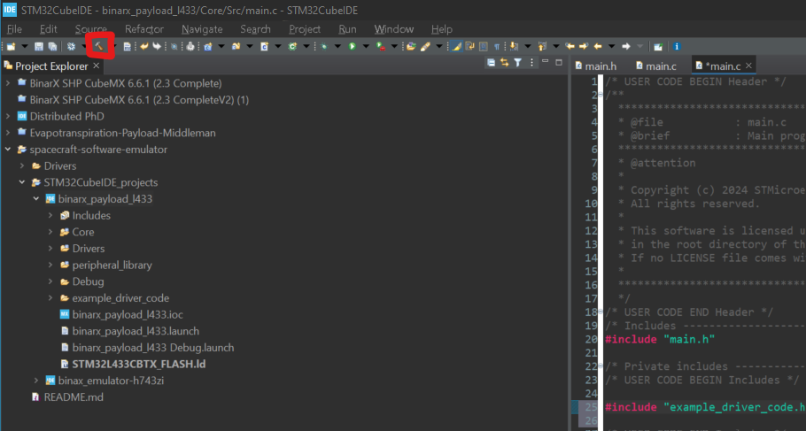

You have now successfully installed the driver code.

Follow the readme.md under the specific driver folder for further information on use.
